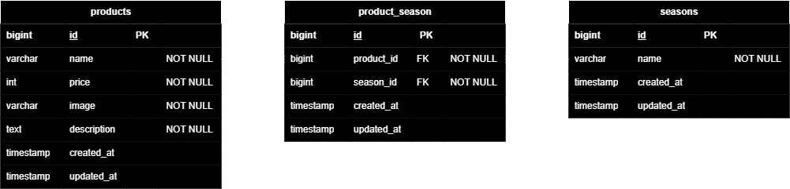

# mogitate(フリマサイト)

## 環境構築

**Dockerビルド**

1. `git clone git@github.com:shiro03shiro/test_mogitate.git`
2. DockerDesktopアプリを立ち上げる
3. `docker-compose up -d --build`

**Laravel環境構築**

1. `docker-compose exec php bash`
2. `composer install`
3. `cp .env.example .env`
4. .envに以下の環境変数を追加

```text
DB_CONNECTION=mysql
DB_HOST=mysql
DB_PORT=3306
DB_DATABASE=laravel_db
DB_USERNAME=laravel_user
DB_PASSWORD=laravel_pass
```

5. 必須コマンド

```bash
php artisan key:generate
php artisan migrate
php artisan db:seed
php artisan storage:link
```

6. 権限設定

```bash
chmod -R 775 storage bootstrap/cache
chown -R www-data:www-data storage bootstrap/cache
touch storage/logs/laravel.log
chown www-data:www-data storage/logs/laravel.log
```

## 使用技術(実行環境)

- PHP 8.2
- Laravel 8.83.8
- jquery 3.7.1.min.js
- MySQL 8.0.26
- nginx 1.21.1

## ER図



## URL

- 開発環境：http://localhost/products
- phpMyAdmin：http://localhost:8080/
